# Historia testów — Kubernetes Network & Security Lab

Dokument zawiera historię testów wykonanych podczas rozwoju projektu.  
Każdy test opisuje jego cel, środowisko, procedurę wykonania, użyte komendy, wynik oraz wnioski.

**Uwaga:** nazwy Podów, adresy IP, wartości `AGE` oraz inne dynamicznie
przydzielane identyfikatory przedstawiają stan zaobserwowany podczas
konkretnego wykonania testu i przy ponownym uruchomieniu mogą przyjmować
inne wartości.

---

## Test #1 — Dockerfile → Image → Container

**Data:** 20.08.2026

**Cel:**  
Sprawdzenie, czy przygotowaną aplikację można poprawnie zbudować jako obraz Docker i uruchomić jako kontener.

**Środowisko:**
- Windows 11 + WSL2
- Ubuntu 24.04
- Docker Desktop z integracją WSL
- aplikacja Python/Flask
- obraz: `kubernetes-network-security-lab:0.1`
- kontener: `kns-lab`

### Procedura

1. Przygotowano `Dockerfile` dla aplikacji.
2. Zbudowano obraz Docker aplikacji.
3. Sprawdzono, czy obraz został poprawnie utworzony.
4. Utworzono i uruchomiono kontener `kns-lab` z mapowaniem portu `8080:8080`.
5. Zweryfikowano, czy kontener znajduje się wśród działających kontenerów.

### Użyte komendy

```bash
docker build -t kubernetes-network-security-lab:0.1 .
docker image ls
docker run --name kns-lab -p 8080:8080 kubernetes-network-security-lab:0.1
docker ps
```

### Wynik

Obraz `kubernetes-network-security-lab:0.1` został poprawnie zbudowany, a kontener `kns-lab` uruchomił się z wystawionym portem `8080`.

### Wniosek

Proces:

`Dockerfile → Docker Image → Container`

działa poprawnie i stanowi podstawę do dalszych testów sieciowych oraz późniejszego wdrożenia aplikacji w Kubernetes.

### Materiał dowodowy

Dla tego testu nie zachowano osobnego screenshotu. W razie potrzeby test może zostać ponownie wykonany podczas końcowego smoke testu projektu.

---

## Test #2–#3 — Komunikacja między kontenerami i Docker DNS

**Data:** 21.08.2026

**Cel:**  
Sprawdzenie, czy dwa kontenery Docker podłączone do tej samej własnej sieci typu `bridge` mogą komunikować się ze sobą oraz czy Docker umożliwia rozwiązywanie nazw kontenerów przez wewnętrzny DNS.

**Środowisko:**
- Docker Desktop z integracją WSL
- kontener aplikacji: `kns-lab`
- tymczasowy kontener klienta: `kns-client`
- obraz klienta: `curlimages/curl:latest`
- własna sieć Docker: `kns-network`
- aplikacja nasłuchująca na porcie `8080`

### Procedura

1. Zweryfikowano stan istniejącego kontenera `kns-lab`.
2. Uruchomiono zatrzymany kontener aplikacji.
3. Utworzono własną sieć Docker typu `bridge` o nazwie `kns-network`.
4. Podłączono kontener `kns-lab` do nowo utworzonej sieci.
5. Zweryfikowano konfigurację sieci i adres IP kontenera.
6. Uruchomiono tymczasowy kontener `kns-client` w tej samej sieci.
7. Z kontenera klienta wysłano żądanie HTTP do aplikacji, wykorzystując nazwę kontenera `kns-lab`, a nie jego adres IP.
8. Po zakończeniu żądania tymczasowy kontener klienta został automatycznie usunięty dzięki opcji `--rm`.

### Użyte komendy

```bash
docker ps -a
docker start kns-lab
docker ps

docker network create kns-network
docker network connect kns-network kns-lab
docker network inspect kns-network

docker run --rm \
  --name kns-client \
  --network kns-network \
  curlimages/curl:latest \
  http://kns-lab:8080
```

### Wynik

Kontener `kns-client` poprawnie połączył się z aplikacją działającą w kontenerze `kns-lab`.

Połączenie zostało wykonane przy użyciu adresu:

`http://kns-lab:8080`

zamiast bezpośredniego adresu IP kontenera.

Test potwierdził jednocześnie:

- poprawną komunikację `container-to-container` w ramach wspólnej sieci `kns-network`,
- poprawne działanie wewnętrznego DNS Dockera dla kontenerów należących do własnej sieci typu `bridge`.

### Wniosek

Kontenery znajdujące się w tej samej własnej sieci Docker mogą komunikować się bezpośrednio, a Docker umożliwia odwoływanie się do innych kontenerów po ich nazwach.

Pozwala to uniknąć zależności od dynamicznie przydzielanych adresów IP i stanowi dobre wprowadzenie do późniejszego mechanizmu DNS oraz `Service` w Kubernetes.

### Materiał dowodowy

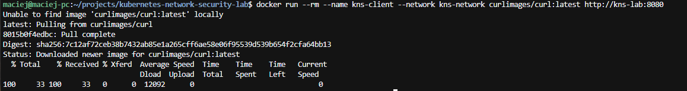

---

## Test #4 — Izolacja sieci Docker

**Data:** 22.08.2026

**Cel:**  
Sprawdzenie, czy kontenery znajdujące się w dwóch różnych własnych sieciach Docker typu `bridge` są od siebie odizolowane oraz czy dołączenie klienta do wspólnej sieci przywraca komunikację.

Dodatkowym celem było rozróżnienie:
- problemu z rozwiązywaniem nazw DNS,
- faktycznego braku łączności sieciowej po adresie IP.

**Środowisko:**
- kontener aplikacji: `kns-lab`
- kontener klienta: `kns-client`
- obraz klienta: `curlimages/curl:latest`
- sieć aplikacji: `kns-network`
- oddzielna sieć klienta: `kns-isolated`
- aplikacja nasłuchująca na porcie `8080`
- adres IP `kns-lab` w `kns-network`: `172.18.0.2`

### Procedura

1. Utworzono drugą, niezależną sieć Docker:

```bash
docker network create kns-isolated
```

2. Utworzono i uruchomiono stały kontener klienta wyłącznie w sieci `kns-isolated`:

```bash
docker run -dit \
  --name kns-client \
  --network kns-isolated \
  --entrypoint sh \
  curlimages/curl:latest
```

3. Uruchomiono kontener aplikacji:

```bash
docker start kns-lab
```

4. Zweryfikowano, że oba kontenery działają:

```bash
docker ps
```

5. Spróbowano połączyć się z aplikacją po nazwie kontenera:

```bash
docker exec kns-client \
  curl -sS --connect-timeout 3 \
  http://kns-lab:8080
```

### Wynik części 1 — test DNS

Połączenie zakończyło się błędem:

```text
curl: (28) Resolving timed out after 3000 milliseconds
```

Kontener `kns-client`, znajdujący się w `kns-isolated`, nie był w stanie rozwiązać nazwy `kns-lab`, ponieważ oba kontenery nie należały do tej samej własnej sieci Docker.

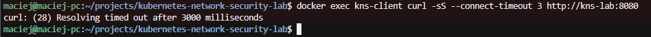

6. Odczytano adres IP kontenera `kns-lab` w sieci `kns-network`:

```bash
docker inspect -f '{{(index .NetworkSettings.Networks "kns-network").IPAddress}}' kns-lab
```

Wynik:

```text
172.18.0.2
```

7. Powtórzono próbę komunikacji, tym razem bezpośrednio po adresie IP, z całkowitym pominięciem DNS:

```bash
docker exec kns-client \
  curl -sS --connect-timeout 3 \
  http://172.18.0.2:8080
```

### Wynik części 2 — test po adresie IP

Połączenie również zakończyło się błędem:

```text
curl: (28) Connection timed out after 3002 milliseconds
```

Potwierdziło to, że brak komunikacji nie wynikał wyłącznie z niedostępności DNS. Ruch HTTP pomiędzy kontenerami znajdującymi się w oddzielnych sieciach również nie przechodził.

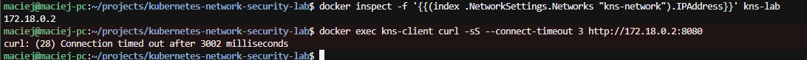

8. Następnie dołączono `kns-client` również do sieci `kns-network`:

```bash
docker network connect kns-network kns-client
```

9. Zweryfikowano konfigurację wspólnej sieci:

```bash
docker network inspect kns-network
```

Po dołączeniu:
- `kns-lab` posiadał adres `172.18.0.2/16`,
- `kns-client` posiadał adres `172.18.0.3/16`.

Kontener `kns-client` pozostał jednocześnie podłączony do `kns-isolated`.

10. Powtórzono test komunikacji po nazwie kontenera:

```bash
docker exec kns-client \
  curl -sS --connect-timeout 3 \
  http://kns-lab:8080
```

### Wynik części 3 — wspólna sieć

Tym razem aplikacja odpowiedziała poprawnie:

```text
Kubernetes Network & Security Lab
```

Po dołączeniu obu kontenerów do wspólnej sieci `kns-network` komunikacja HTTP oraz rozwiązywanie nazwy `kns-lab` zaczęły działać.

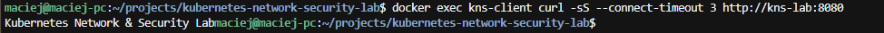

### Wniosek

Test wykazał, że kontenery umieszczone w oddzielnych własnych sieciach Docker typu `bridge` są od siebie odizolowane.

Zaobserwowano:

- brak rozwiązywania nazwy `kns-lab` pomiędzy oddzielnymi sieciami,
- brak komunikacji bezpośrednio po adresie IP,
- poprawną komunikację po dołączeniu klienta do wspólnej sieci,
- poprawne działanie wewnętrznego DNS Dockera we wspólnej sieci,
- możliwość jednoczesnego podłączenia jednego kontenera do więcej niż jednej sieci Docker.

Test stanowi praktyczną demonstrację segmentacji i izolacji sieciowej i może być później wykorzystany jako punkt odniesienia do mechanizmu `NetworkPolicy` w Kubernetes.

---

## Test #5 — Uruchomienie i weryfikacja lokalnego klastra Kubernetes

**Data:** 22.08.2026

**Cel:**  
Sprawdzenie, czy lokalny klaster Kubernetes uruchomiony w Docker Desktop działa poprawnie, czy `kubectl` ma poprawnie skonfigurowany kontekst oraz czy node klastra jest gotowy do pracy.

**Środowisko:**
- Docker Desktop
- Kubernetes w Docker Desktop
- metoda provisioningu klastra: `kind`
- liczba node’ów: `1`
- Kubernetes: `v1.36.1`
- `kubectl`: `v1.36.1`
- WSL2 / Ubuntu 24.04

### Procedura

1. Sprawdzono, czy klient `kubectl` jest zainstalowany:

```bash
kubectl version --client
```

Wynik:

```text
Client Version: v1.36.1
Kustomize Version: v5.8.1
```

2. Sprawdzono dostępne konteksty Kubernetes:

```bash
kubectl config get-contexts
```

Przed uruchomieniem klastra lista kontekstów była pusta.

3. W Docker Desktop włączono Kubernetes z następującymi ustawieniami:
- provisioning: `kind`,
- Kubernetes version: `1.36.1`,
- liczba node’ów: `1`.

4. Po uruchomieniu klastra Docker Desktop potwierdził jego stan jako `Running`.

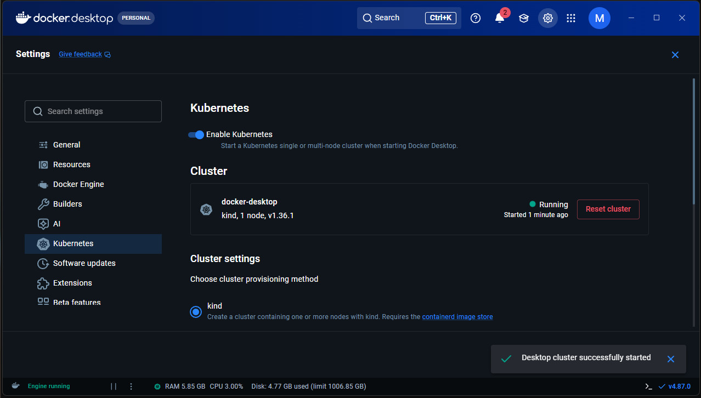

5. Ponownie sprawdzono konteksty:

```bash
kubectl config get-contexts
```

Wynik:

```text
CURRENT   NAME             CLUSTER          AUTHINFO         NAMESPACE
*         docker-desktop   docker-desktop   docker-desktop
```

6. Sprawdzono stan node’a:

```bash
kubectl get nodes
```

Wynik:

```text
NAME                    STATUS   ROLES           VERSION
desktop-control-plane   Ready    control-plane   v1.36.1
```

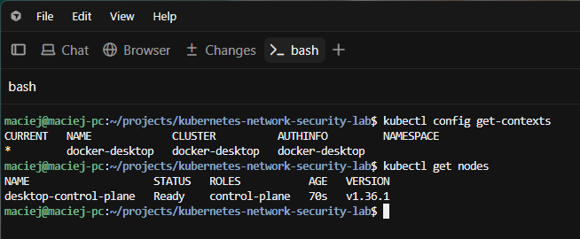

### Wynik

Klaster `docker-desktop` został poprawnie uruchomiony i był dostępny z poziomu `kubectl`.

Node:

```text
desktop-control-plane
```

osiągnął stan:

```text
Ready
```

### Wniosek

Środowisko Kubernetes zostało poprawnie przygotowane do dalszego wdrażania zasobów aplikacyjnych.

Test potwierdził:
- działanie `kubectl`,
- poprawną konfigurację kontekstu `docker-desktop`,
- komunikację `kubectl` z API klastra,
- gotowość node’a control-plane do pracy.

---

## Test #6 — Pierwsze wdrożenie aplikacji do Kubernetes

**Data:** 22.08.2026

**Cel:**  
Sprawdzenie, czy manifest `k8s/deployment.yaml` poprawnie tworzy Deployment oraz czy Kubernetes uruchamia Pod z aplikacją na podstawie obrazu `kubernetes-network-security-lab:0.1`.

**Środowisko:**
- lokalny klaster Kubernetes `docker-desktop`
- provisioning: `kind`
- 1 node: `desktop-control-plane`
- Kubernetes `v1.36.1`
- manifest: `k8s/deployment.yaml`
- Deployment: `kns-lab`
- obraz kontenera: `kubernetes-network-security-lab:0.1`

### Procedura

1. Będąc w katalogu `k8s`, zastosowano przygotowany manifest Deploymentu:

```bash
kubectl apply -f deployment.yaml
```

Wynik:

```text
deployment.apps/kns-lab created
```

2. Następnie sprawdzono stan utworzonych Podów:

```bash
kubectl get pods
```

Wynik:

```text
NAME                       READY   STATUS    RESTARTS   AGE
kns-lab-7b78dd8fd-fb8zr    1/1     Running   0          45s
```

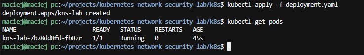

3. Sprawdzono również Deployment:

```bash
kubectl get deployments
```

4. Zweryfikowano utworzony ReplicaSet:

```bash
kubectl get replicasets
```

Zaobserwowano zależność:

```text
Deployment
    ↓
ReplicaSet
    ↓
Pod
    ↓
Container
```

### Wynik

Manifest Deploymentu został poprawnie zaakceptowany przez Kubernetes.

Deployment `kns-lab` utworzył Pod:

```text
kns-lab-7b78dd8fd-fb8zr
```

który osiągnął:

```text
READY:    1/1
STATUS:   Running
RESTARTS: 0
```

Stan `1/1` oznaczał, że jedyny kontener znajdujący się w Podzie był gotowy do pracy.

### Wniosek

Pierwsze wdrożenie aplikacji do lokalnego klastra Kubernetes zakończyło się sukcesem.

Test potwierdził prawidłowe działanie procesu:

`manifest YAML → Deployment → ReplicaSet → Pod → Container`

oraz poprawne uruchomienie aplikacji jako zasobu zarządzanego przez Kubernetes.

---

## Test #7 — Self-healing Kubernetesa

**Data:** 07.09.2026

**Cel:**  
Sprawdzenie, czy Kubernetes automatycznie odtworzy Pod po jego ręcznym usunięciu, tak aby ponownie osiągnąć zadeklarowany w Deploymentcie stan `replicas: 1`.

**Środowisko:**
- lokalny klaster Kubernetes `docker-desktop`
- Deployment: `kns-lab`
- ReplicaSet: `kns-lab-7b78dd8fd`
- zadeklarowana liczba replik: `1`
- aplikacja działająca w Podzie zarządzanym przez Deployment

### Procedura

1. Sprawdzono stan początkowy Poda:

```bash
kubectl get pods
```

Stan początkowy:

```text
NAME                       READY   STATUS    RESTARTS
kns-lab-7b78dd8fd-fb8zr    1/1     Running   1
```

Pod był uruchomiony i gotowy do pracy.

2. Ręcznie usunięto działający Pod:

```bash
kubectl delete pod kns-lab-7b78dd8fd-fb8zr
```

Kubernetes potwierdził rozpoczęcie usuwania:

```text
pod "kns-lab-7b78dd8fd-fb8zr" deleted from default namespace
```

3. Po zakończeniu operacji ponownie sprawdzono stan Podów:

```bash
kubectl get pods
```

Zaobserwowano nowy Pod:

```text
NAME                       READY   STATUS    RESTARTS
kns-lab-7b78dd8fd-z4vhw    1/1     Running   0
```

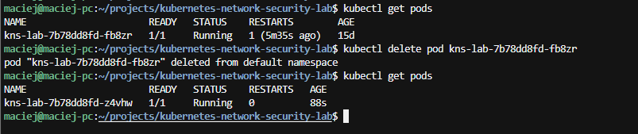

### Wynik

Ręcznie usunięty Pod:

```text
kns-lab-7b78dd8fd-fb8zr
```

został zastąpiony nowym Podem:

```text
kns-lab-7b78dd8fd-z4vhw
```

Nowy Pod osiągnął stan:

```text
READY:    1/1
STATUS:   Running
RESTARTS: 0
```

Część nazwy:

```text
kns-lab-7b78dd8fd
```

pozostała taka sama, ponieważ nowy Pod został utworzony przez ten sam ReplicaSet. Zmienił się jedynie końcowy sufiks identyfikujący konkretną instancję Poda.

### Wniosek

Kubernetes poprawnie zareagował na ręczne usunięcie Poda i automatycznie utworzył nową instancję, aby przywrócić zadeklarowany stan:

```text
DESIRED = 1
ACTUAL  = 1
```

Test potwierdził mechanizm **self-healing**, czyli jedną z podstawowych właściwości Kubernetesa.

Proces można przedstawić jako:

```text
Deployment: replicas = 1
        ↓
ReplicaSet utrzymuje 1 Pod
        ↓
ręczne usunięcie Poda
        ↓
chwilowo brak wymaganej repliki
        ↓
ReplicaSet wykrywa różnicę
        ↓
utworzenie nowego Poda
        ↓
stan ponownie zgodny z deklaracją
```

---

## Test #8 — Service, DNS i routing HTTP do Poda

**Data:** 07.09.2026

**Cel:**  
Sprawdzenie, czy obiekt `Service` typu `ClusterIP` poprawnie odnajduje Pod aplikacji na podstawie labeli oraz czy możliwa jest komunikacja HTTP z aplikacją przy użyciu nazwy DNS Service.

**Środowisko:**
- lokalny klaster Kubernetes `docker-desktop`
- Deployment: `kns-lab`
- Pod aplikacji z labelem `app: kns-lab`
- manifest Service: `k8s/service.yaml`
- Service: `kns-lab-service`
- typ Service: `ClusterIP`
- port Service: `8080`
- `targetPort`: `8080`

### Procedura

1. Utworzono manifest `k8s/service.yaml`:

```yaml
apiVersion: v1
kind: Service

metadata:
  name: kns-lab-service

spec:
  selector:
    app: kns-lab

  ports:
    - protocol: TCP
      port: 8080
      targetPort: 8080

  type: ClusterIP
```

2. Zastosowano manifest:

```bash
kubectl apply -f k8s/service.yaml
```

Wynik:

```text
service/kns-lab-service created
```

3. Sprawdzono utworzony Service:

```bash
kubectl get services
```

Zaobserwowano:

```text
NAME              TYPE        CLUSTER-IP      EXTERNAL-IP   PORT(S)
kns-lab-service   ClusterIP   10.96.67.122    <none>        8080/TCP
```

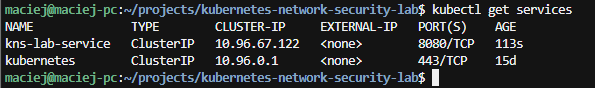

4. Sprawdzono, czy Service poprawnie odnalazł Pod aplikacji:

```bash
kubectl get endpointslices -l kubernetes.io/service-name=kns-lab-service
```

Wynik wskazywał endpoint:

```text
ENDPOINTS: 10.244.0.6
PORTS:     8080
```

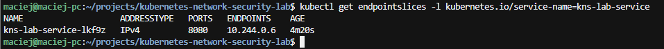

5. Utworzono tymczasowy Pod-klienta wewnątrz klastra i wykonano żądanie HTTP do aplikacji przy użyciu nazwy DNS Service:

```bash
kubectl run kns-test-client --rm -it \
  --image=curlimages/curl:latest \
  --restart=Never \
  -- curl -sS http://kns-lab-service:8080
```

### Wynik

Aplikacja zwróciła poprawną odpowiedź:

```text
Kubernetes Network & Security Lab
```

Po zakończeniu testu tymczasowy Pod klienta został automatycznie usunięty dzięki opcji:

```text
--rm
```

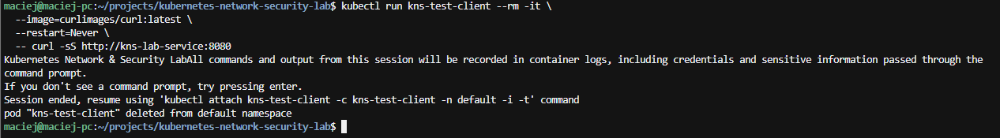

Test potwierdził jednocześnie:

- poprawne utworzenie Service typu `ClusterIP`,
- poprawne działanie selektora `app: kns-lab`,
- utworzenie EndpointSlice wskazującego Pod aplikacji,
- poprawne działanie wewnętrznego DNS Kubernetes,
- routing ruchu HTTP z Service do Poda,
- brak konieczności znajomości adresu IP konkretnego Poda przez klienta.

### Wniosek

Obiekt `Service` zapewnił stabilny punkt dostępu do aplikacji działającej w Podzie.

Klient mógł odwołać się do:

```text
http://kns-lab-service:8080
```

zamiast bezpośrednio do dynamicznego adresu IP Poda.

Przepływ komunikacji można przedstawić jako:

```text
kns-test-client
        │
        │ DNS query: kns-lab-service
        ▼
DNS Kubernetes
        │
        │ 10.96.67.122
        ▼
Service ClusterIP
10.96.67.122:8080
        │
        │ TCP :8080
        ▼
Pod
10.244.0.6:8080
        │
        ▼
Container


Service selector: app=kns-lab
        ↓
EndpointSlice
        ↓
10.244.0.6:8080
```

Test stanowi praktyczne potwierdzenie działania podstawowych mechanizmów sieciowych Kubernetes związanych z `Service`, DNS i routowaniem ruchu do Poda.

---

## Test #9 — Skalowanie Deploymentu `1 → 3 → 1`

**Data:** 07.09.2026

**Cel:**  
Sprawdzenie, czy Kubernetes poprawnie zwiększa i zmniejsza liczbę replik aplikacji zarządzanej przez Deployment oraz czy ReplicaSet automatycznie dopasowuje liczbę Podów do oczekiwanego stanu.

**Środowisko:**
- lokalny klaster Kubernetes `docker-desktop`
- Deployment: `kns-lab`
- ReplicaSet: `kns-lab-7b78dd8fd`
- stan początkowy: `1` replika
- manifest `deployment.yaml` z wartością `replicas: 1`

### Procedura

1. Sprawdzono stan początkowy Podów:

```bash
kubectl get pods
```

Wynik:

```text
NAME                       READY   STATUS    RESTARTS   AGE
kns-lab-7b78dd8fd-z4vhw    1/1     Running   0          112m
```

2. Zwiększono liczbę replik Deploymentu z `1` do `3`:

```bash
kubectl scale deployment kns-lab --replicas=3
```

Kubernetes potwierdził operację:

```text
deployment.apps/kns-lab scaled
```

3. Sprawdzono stan Podów:

```bash
kubectl get pods
```

Zaobserwowano trzy działające Pody:

```text
kns-lab-7b78dd8fd-9lmxq   1/1   Running
kns-lab-7b78dd8fd-nkw8n   1/1   Running
kns-lab-7b78dd8fd-z4vhw   1/1   Running
```

4. Zweryfikowano stan Deploymentu:

```bash
kubectl get deployment kns-lab
```

Wynik:

```text
NAME      READY   UP-TO-DATE   AVAILABLE
kns-lab   3/3     3            3
```

Oznaczało to, że wszystkie trzy wymagane repliki zostały poprawnie uruchomione i były dostępne.

5. Zmniejszono liczbę replik z `3` do `1`:

```bash
kubectl scale deployment kns-lab --replicas=1
```

6. Ponownie sprawdzono stan Podów:

```bash
kubectl get pods
```

Zaobserwowano, że dwa nadmiarowe Pody przeszły w stan:

```text
Terminating
```

a następnie zostały usunięte.

7. Na końcu ponownie zweryfikowano Deployment:

```bash
kubectl get deployment kns-lab
```

Stan końcowy:

```text
READY:        1/1
UP-TO-DATE:   1
AVAILABLE:    1
```

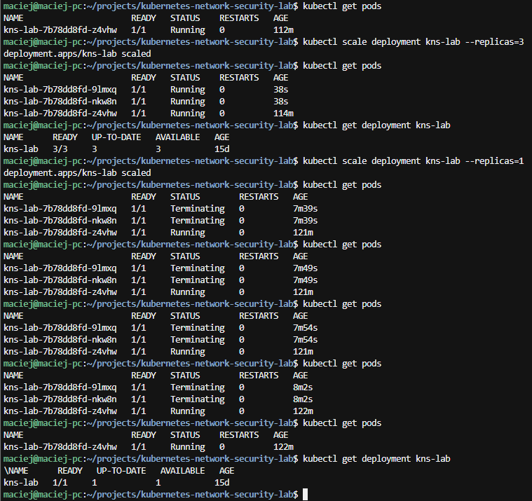

### Wynik

Deployment został poprawnie przeskalowany:

```text
1 replika
    ↓
3 repliki
    ↓
1 replika
```

Podczas skalowania w górę Kubernetes pozostawił istniejący Pod i utworzył dwie nowe repliki.

Podczas skalowania w dół dwie nadmiarowe repliki zostały automatycznie zakończone, a klaster powrócił do jednej działającej repliki.

### Wniosek

Kubernetes poprawnie zarządza liczbą replik aplikacji i automatycznie dopasowuje stan rzeczywisty do oczekiwanej liczby instancji.

Test potwierdził działanie mechanizmu skalowania Deploymentu oraz rolę ReplicaSetu w utrzymywaniu wymaganej liczby Podów.

Po zakończeniu testu stan klastra ponownie odpowiadał konfiguracji zapisanej w `deployment.yaml`:

```yaml
replicas: 1
```

---
